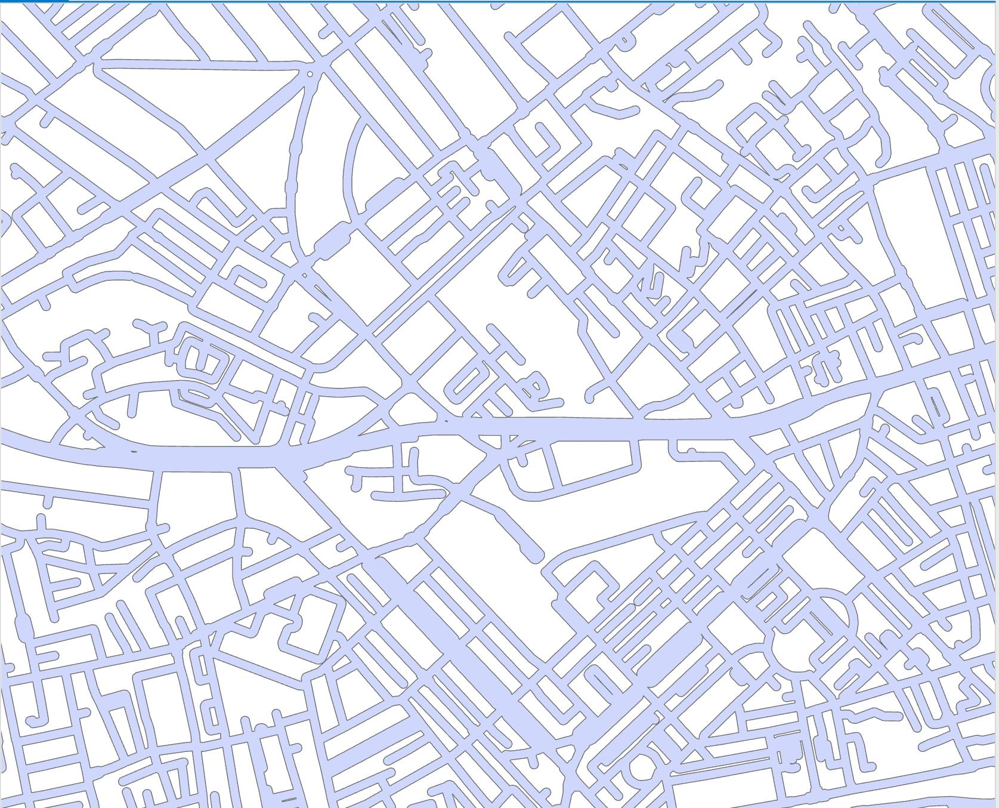
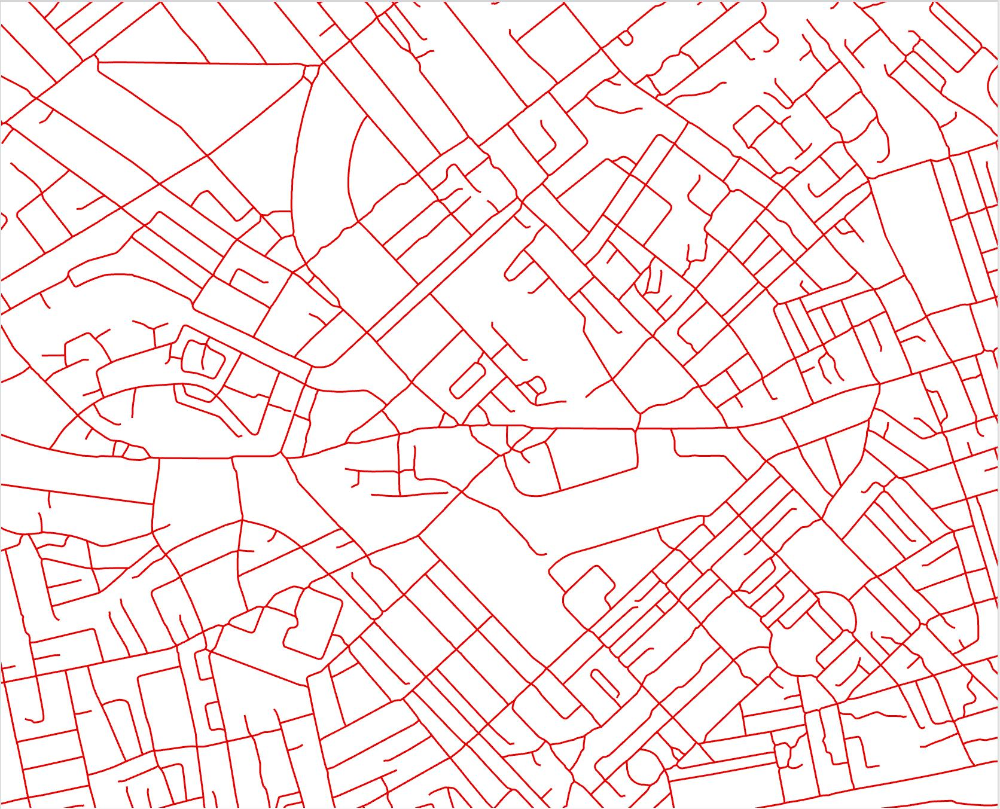
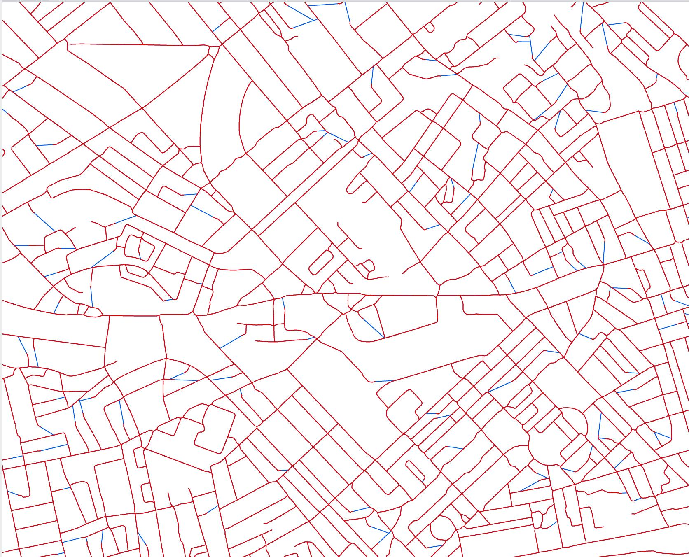
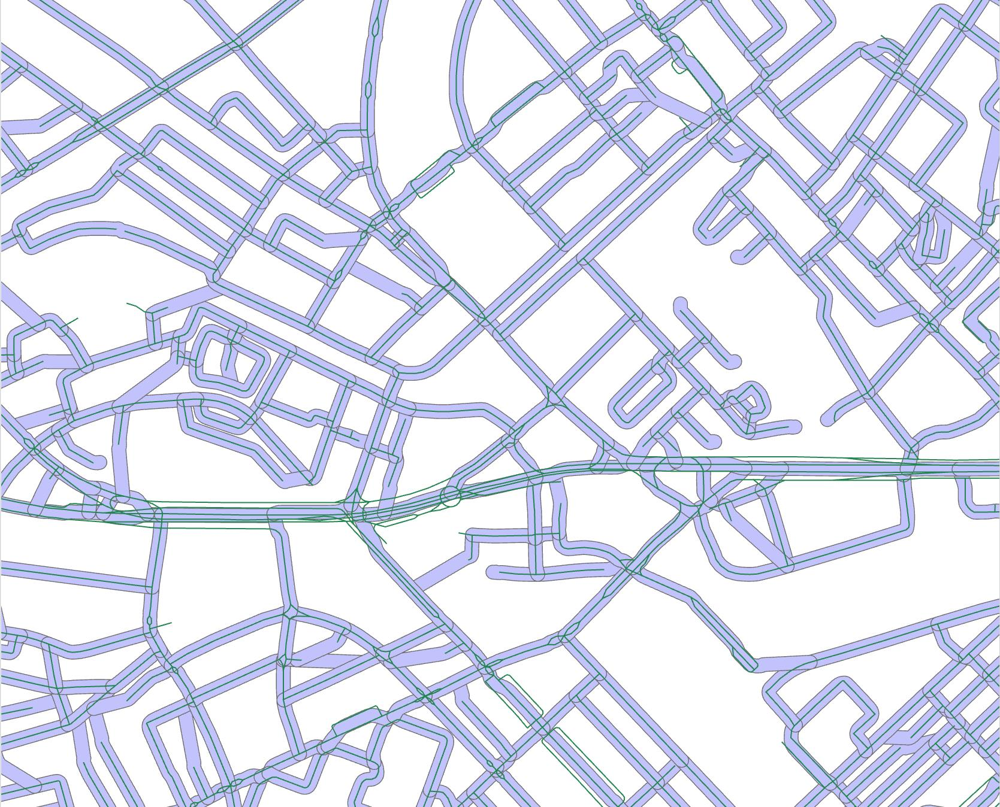
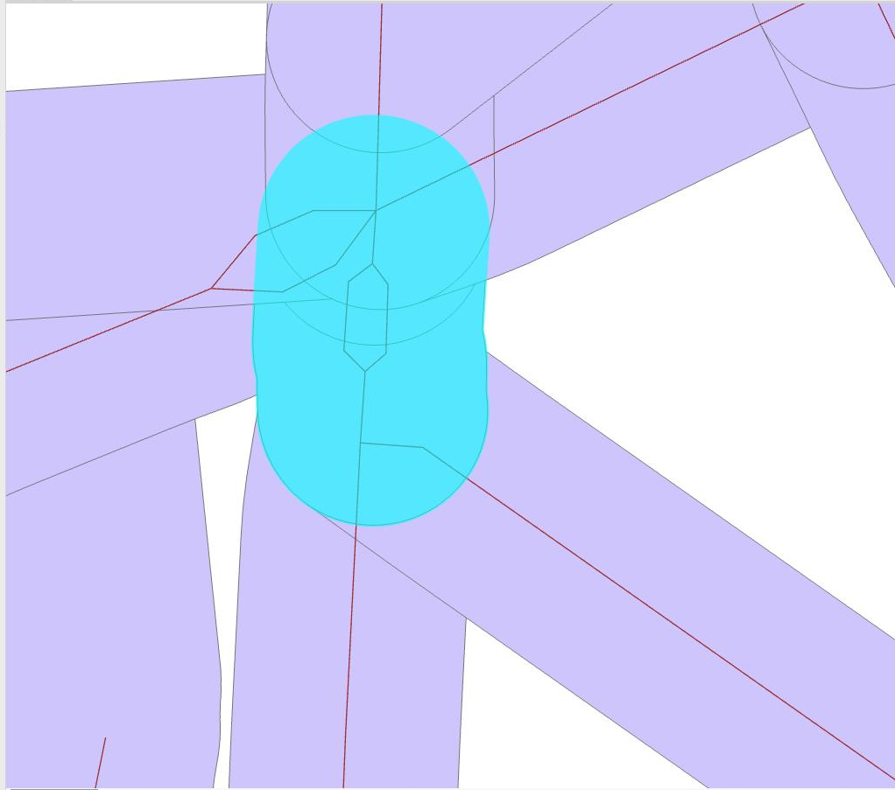

中文版              [English](./en.md)     
# road_geo_regularization
### 通用的城市主要道路路网简化，可用于非高精度的地块划分等

### Performance:
#### 原始路网
- 
#### 路网简化结果
- 

### 运行环境:
- Arcgis Pro
- Python 3.x from Arcgis Pro 
- Arcpy from Arcgis Pro
- Encoding utf-8_sig

### 所需数据：
- 路网数据
- boundary边界数据
- 数据需要事先按照config.py路径放置，注意命名格式

### 说明书：
1. 先在config/config.py里手动指定目录
    - 配置项：
        - ./config/config.py 需手动指定：
            - GDB文件路径(不存在会自动创建),所有步骤成功执行会自动清空GDB
            - 路网数据根目录(注意路网数据命名规则)
            - boundary数据根目录(注意命名规则)
        - 道路类别：
            - 目前道路类型选择主要以划分地块为目的，参与简化的路网类别根据config.py中的ROAD_TYPE_FIELD进行筛选，后续定制化精细路网处理时在config.py添加新类即可

2. 执行main.py
    - main.py启动函数start_process主要参数：
        - CITY: 城市名，注意命名需要与路网后缀相同(详见注释)
        - MODE：简化方式，必须为'mixed'
        - smooth_level： 简化程度，值越高结果越平滑(失真)
        - extend_distance： 断头路延伸的距离，值越高，闭合的路网越多，(但会在不存在道路的地方伸出一条道路)
        - spike_keep： 清理毛细断头道路的阈值，道路长度低于这个threshold的都会被清除掉，值越高，道路越规整，但会使一些现实是断头路的道路消失

### 路网简化原理：
1.  Extract CenterLines
    - 
        

                <i>加载原始数据.</i>
        

    - 
        

            <i>对每条道路建立缓冲区.</i>
        

    - 
        

            <i>将重叠缓冲区合并(dissolve).</i>
        

    - 
        

            <i>提取合并后缓冲区的中心线.</i>
        

    - 
    

        <i>提取结果.</i>
    

2.  路网优化:
    - 
        

            <i>非闭合道路延展(蓝色).</i>
        

    - 
        

            <i>提取断头路(points).</i>
        
    
    - 
            

                <i>过滤长度低于threshold的毛刺道路(红色部分).</i>
            
                 
3.  路网空间信息重关联：
    - 
    

        <i>以简化后的道路建立缓冲区，加载原属路网数据准备进行信息赋值.</i>
    

    
    - 
    

        <i>对于某个缓冲区，匹配原路网的规则为选取缓冲区内最具代表性的道路(largest overlap).</i>
    

    
    - 
        

        <i>eg.该缓冲区内最具代表性道路为圈出道路.</i>
    

4.  输出结果
    - 

### 一个隐藏参数：
在simplify.py的clean_spike函数中有一个keep_spike参数被隐藏起来了，不太常用。

可能会在作图时需要用到断头路数据，若需要可手动将keep_spike改为True.

断头点、断头线数据将会输出到结果路径中，分别命名'err_points.shp'及'err_lines.shp'