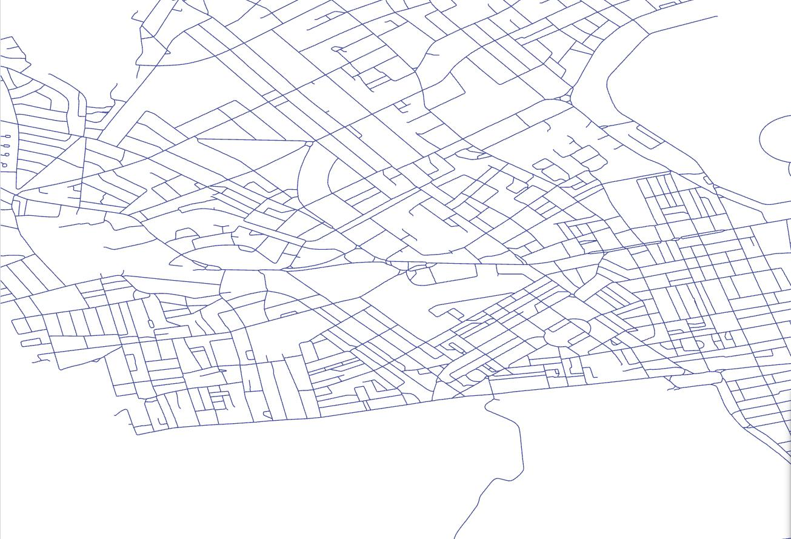
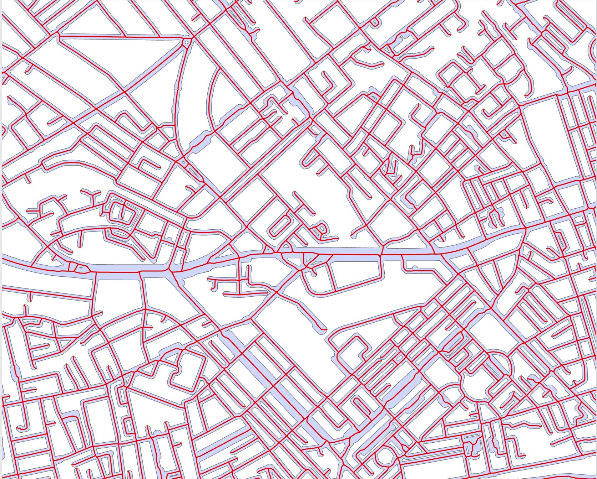
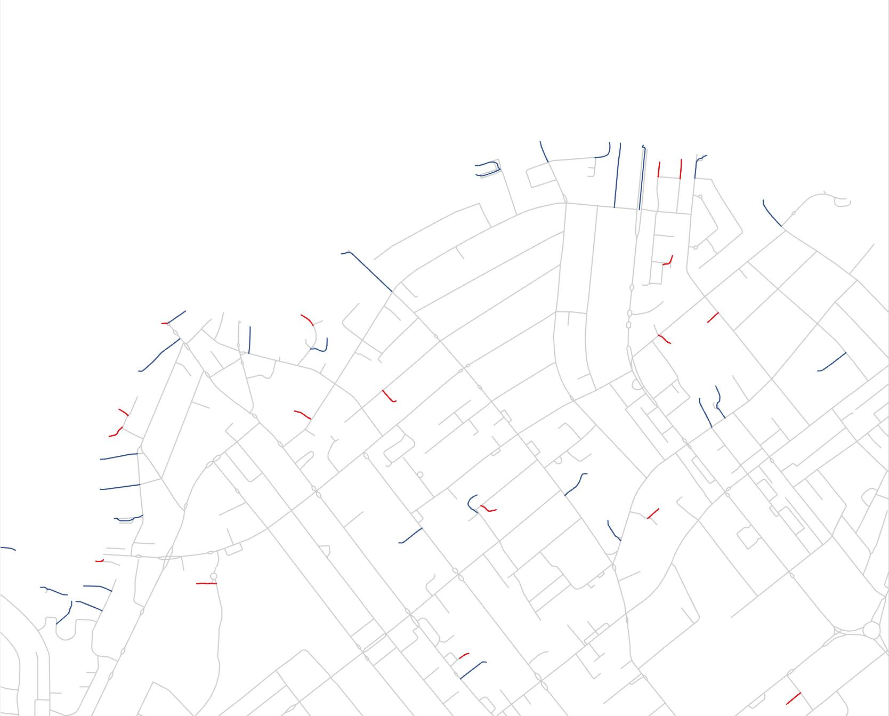
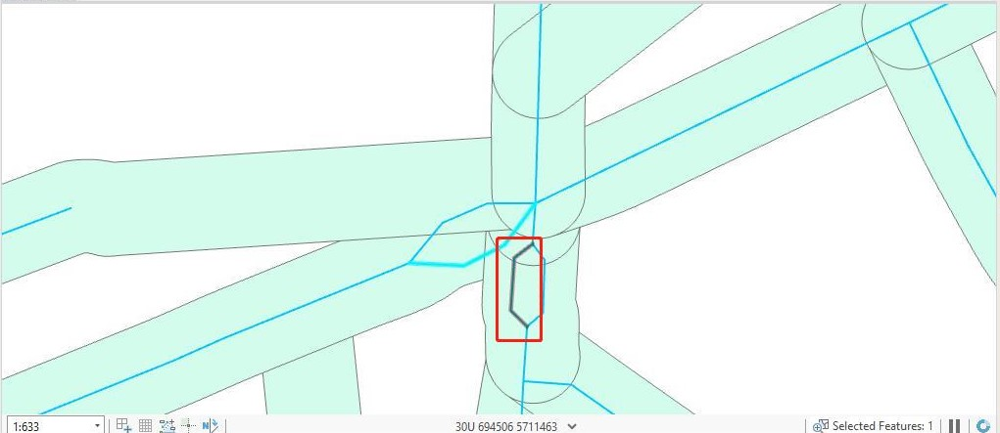

[中文版](./README.md)              English  
# road_geo_regularization
### A universal simplification of the main road network in the city, which can be used for non-high precision land division, etc.

### Performance:
#### raw road data
- 
#### simplified road data
- 

### Environment:
- Arcgis Pro
- Python 3.x from Arcgis Pro 
- Arcpy from Arcgis Pro
- Encoding utf-8_sig

### Required Data:
- Road network data
- Boundary data
- Data needs to be placed in the path specified in config.py in advance, pay attention to the naming format

### User Manual:
1. Specify directories manually in config/config.py

    - Configuration options:
        -  ./config/config.py needs to be manually specified:
        -   GDB file path (automatically created if it doesn't exist), GDB will be automatically cleared if all steps are executed successfully
        -   Road network data root directory (pay attention to the naming conventions of road network data)
        -   Boundary data root directory (pay attention to the naming conventions)
    -   Road types:
        -   Currently, road types are selected mainly for the purpose of parcel division. The road network categories involved in the simplification are filtered based on the ROAD_TYPE_FIELD in config.py. You can add a new category in config.py for customized fine road network processing.

2.  Execute main.py

    -   The main function start_process in main.py accepts the following parameters:
        -   CITY: City name, ensure the naming is the same as the suffix of the road network (see comments for details)
        -   MODE: Simplification mode, must be 'mixed'
        -   smooth_level: Level of simplification, the higher the value, the smoother the result (distortion)
        -   extend_distance: Distance of extending dead-end roads, the higher the value, the more closed road networks (but may extend a road where it does not exist)
        -   spike_keep: Threshold for cleaning small spikes, roads with a length lower than this threshold will be removed, the higher the value, the more regular the roads, but it may remove roads that are actually dead-ends

### Road Network Simplification Principle:
1.  Extract CenterLines
    - 
        

                <i>load raw data.</i>
        

    - 
        

            <i>build buffer for each line.</i>
        

    - 
        

            <i>dissolve the buffers.</i>
        

    - 
        

            <i>Extract centerlines from merged buffers</i>
        

    - 
    

        <i>Extraction result.</i>
    

2.  road optimization:
    - 
        

            <i>Extension of non-closed roads (in blue).</i>
        

    - 
        

            <i>Extraction of dead-end roads (points).</i>
        
    
    - 
            

                <i>Filtering small spikes (in red) with a length below the threshold.</i>
            
                 
3.  Road Network Spatial Information Re-association:：
    - 
    

        <i>Create buffers based on the simplified road network and load the original road network data for information assignment.</i>
    

    
    - 
    

        <i>For each buffer, the matching rule with the original road network is to select the most representative road within the buffer (largest overlap).</i>
    

    
    - 
        

        <i>eg. The most representative road within this buffer is enclosed.</i>
    

4.  output result
    - 

### A Hidden Parameter:
There is a hidden parameter called keep_spike in the clean_spike function in simplify.py, which is not commonly used.

It may be useful when plotting data related to dead-end roads. If needed, you can manually set keep_spike to True.

The data for dead-end points and dead-end lines will be output to the result path, named 'err_points.shp' and 'err_lines.shp', respectively.